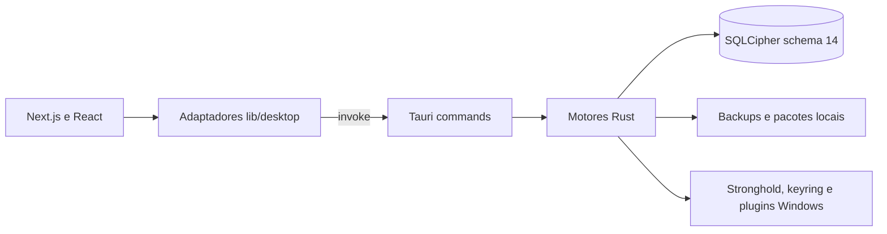

# Arquitetura

## Camadas

- UI: Next.js App Router, React 19, TypeScript e Tailwind CSS 4.
- Adaptadores: `lib/desktop/` encapsula chamadas Tauri e oferece contratos tipados para os componentes.
- Núcleo nativo: Tauri 2 e módulos Rust em `src-tauri/src/`.
- Persistência: SQLite via SQLx, compilado com SQLCipher e OpenSSL incorporados.
- Segredos locais: Stronghold, keyring do Windows e derivação Argon2/PBKDF2 conforme o fluxo.
- Distribuição: export estático Next.js, bundle NSIS, assinatura do updater Tauri e Authenticode separado.

O frontend não acessa diretamente o arquivo de banco. Comandos registrados em `src-tauri/src/lib.rs` cobrem banco cifrado, segurança, backup, continuidade, automações, inteligência, planejamento, conciliação, desempenho, rotinas, diagnóstico e onboarding. Tarefas de background usam fila persistente, leases, tentativas limitadas e outbox de notificações. Não há serviço externo confirmado como requisito para o domínio financeiro; GitHub é usado para distribuição de releases/updater.
